#  SafePath – Planificateur de trajets sécurisés à Paris

> Une application web intelligente permettant de trouver l'itinéraire le plus sûr à Paris en combinant les données de transport, la cartographie interactive et un modèle de Machine Learning d'analyse des zones à risque.

---

#  Aperçu de l'application

## Accueil

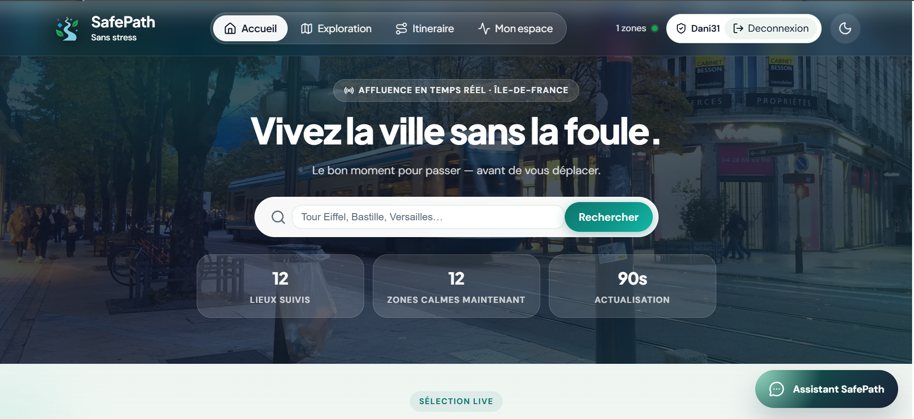

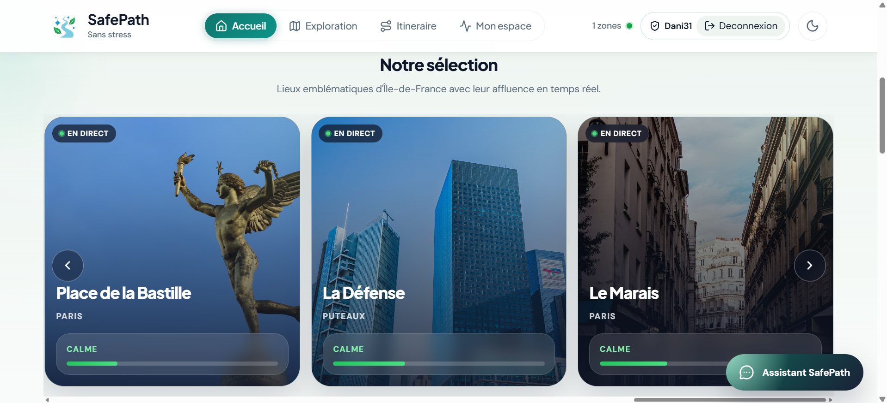

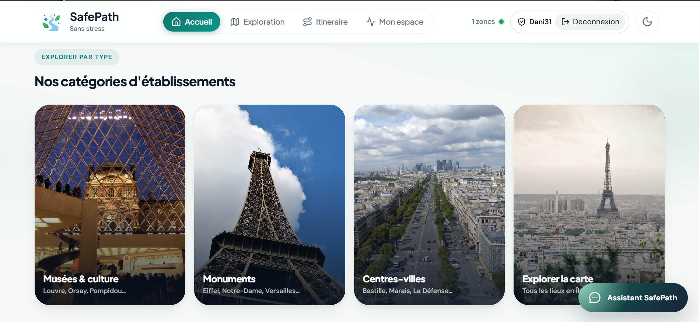

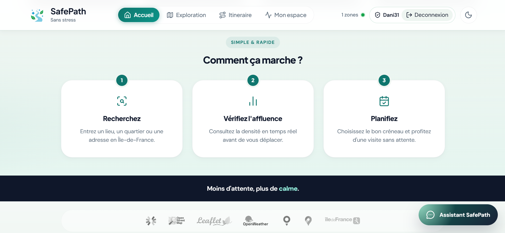

---

## Carte interactive

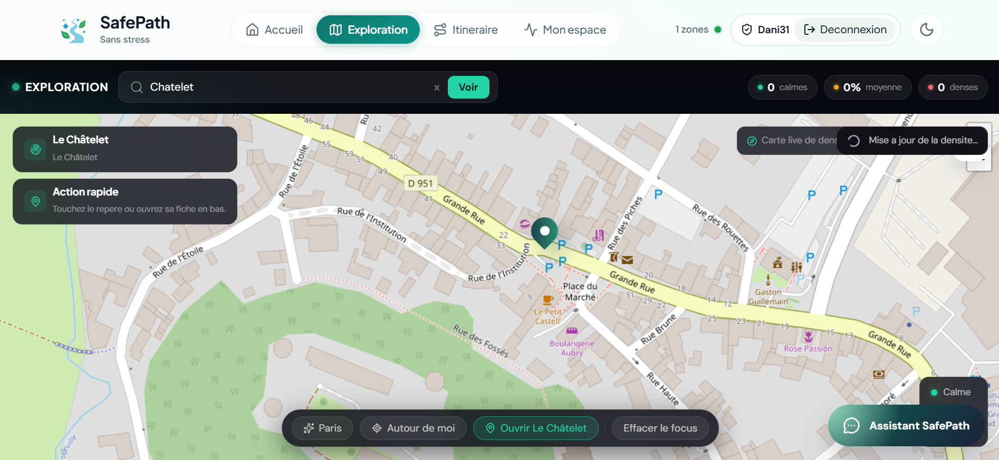

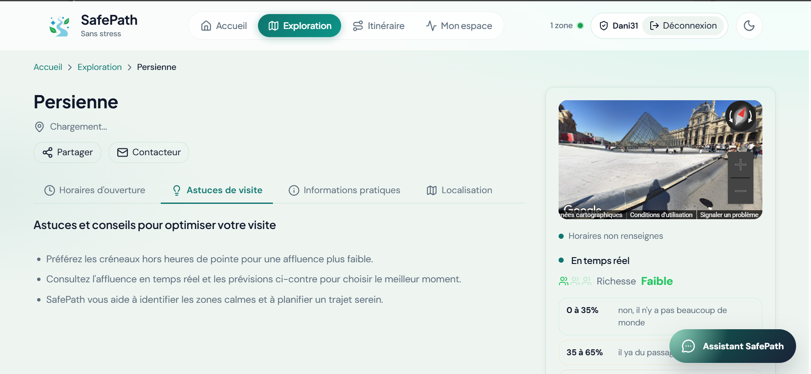

---

## Calcul d'itinéraire

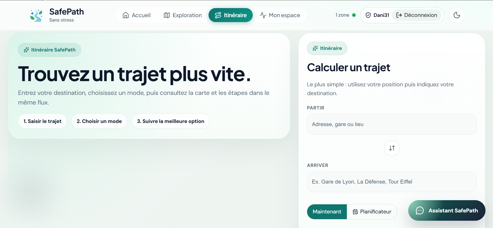

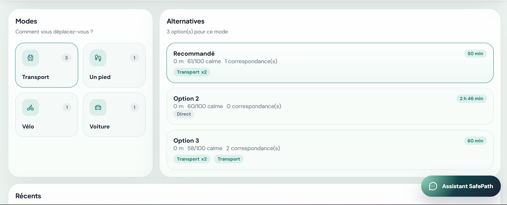

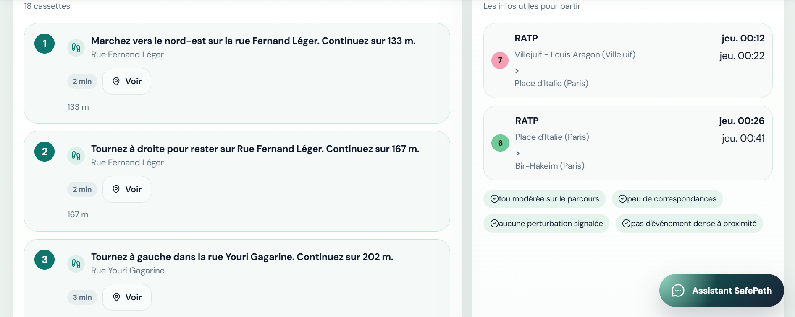

---

## Tableau de bord

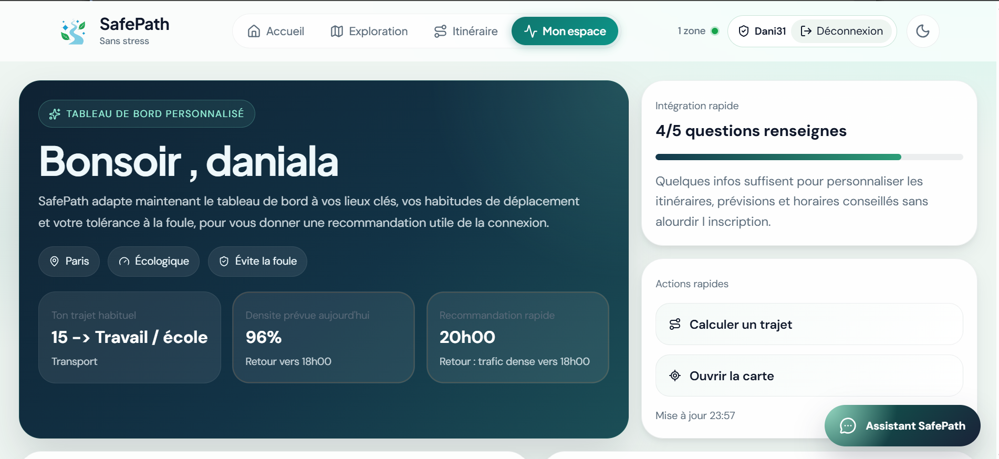

---

## Chatbot IA

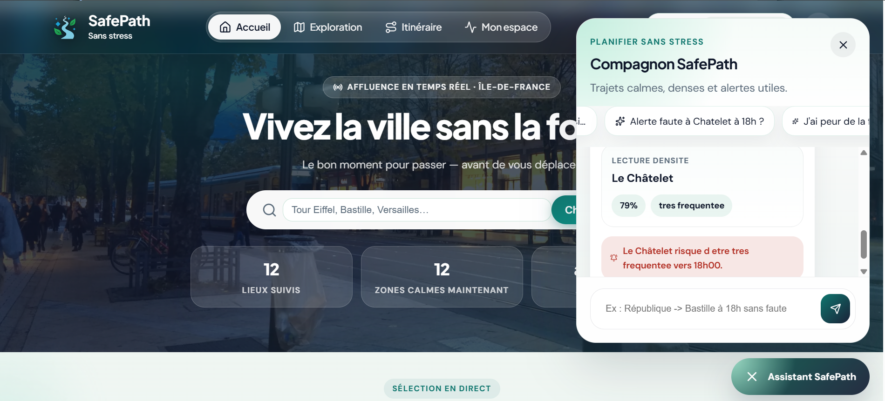

---

# 🎥 Démonstration

La vidéo de démo est trop volumineuse pour GitHub (> 100 Mo).  
Hébergez-la sur **YouTube**, **Google Drive** ou **Streamable**, puis ajoutez le lien ici :

```
https://votre-lien-de-demo
```

> Fichier local (non versionné) : `frontend/src/assets/brands/demo2.mp4`

---

#  Fonctionnalités

-  Calcul d'itinéraires sécurisés
-  Analyse des zones sensibles grâce au Machine Learning
-  Intégration des transports publics (IDFM / Navitia)
-  Cartographie interactive avec Leaflet & Mapbox
-  Tableau de bord statistique
-  Assistant conversationnel IA
-  Recherche d'adresses
-  Temps de calcul optimisé
-  Interface responsive

---

#  Architecture

```
React + Vite
        │
        ▼
 Django REST API
        │
        ▼
PostgreSQL + PostGIS
        │
        ▼
 Machine Learning
        │
        ▼
Cartographie Leaflet + Mapbox
```

---

#  Technologies utilisées

## Frontend

- React
- Vite
- Leaflet
- Mapbox
- Recharts
- Axios

## Backend

- Django
- Django REST Framework
- PostgreSQL
- PostGIS
- Redis
- Pandas
- NumPy
- Scikit-Learn

---

#  Déploiement

## Frontend (Vercel)

```bash
git push origin main
```

Ajouter les variables :

```
VITE_MAPBOX_TOKEN=...
VITE_API_URL=https://safepath-api.onrender.com/api
```

Déployer sur **Vercel**.

---

## Backend (Render)

Créer un Web Service Docker.

Variables :

```
SECRET_KEY=
DEBUG=False

DB_NAME=
DB_HOST=
DB_USER=
DB_PASSWORD=

REDIS_URL=

ALLOWED_HOSTS=*
```

Créer ensuite :

- PostgreSQL
- Redis

Puis lancer le déploiement.

---

#  Installation locale

```bash
git clone https://github.com/votre-repo/SafePath.git

cd SafePath

docker-compose up --build
```

Frontend

```
http://localhost:5173
```

Backend

```
http://localhost:8000/api/
```

---

# Structure du projet

```
SafePath
│
├── frontend
│   ├── src
│   │   └── assets/brands
│   │       ├── S1.png … S15.png   # captures d'écran (README)
│   │       └── demo2.mp4          # démo locale (hors Git, > 100 Mo)
│   └── public
│
├── backend
│   ├── api
│   ├── ml_model
│   └── Dockerfile
│
└── docker-compose.yml
```

---

#  Perspectives

- Authentification des utilisateurs
- Historique des trajets
- Notifications en temps réel
- Détection automatique d'incidents
- Application mobile

